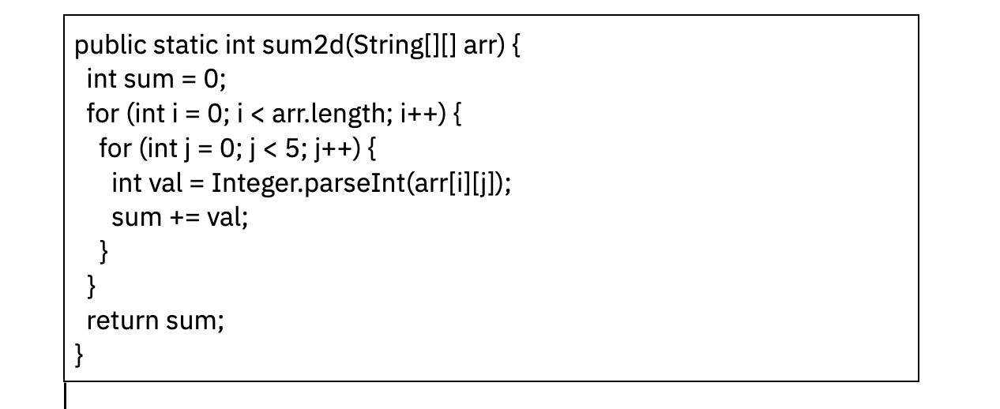

# Домашняя работа №1

## Задания:

1. Реализуйте 3 метода, чтобы в каждом из них получить разные исключения

    [Задача 1](https://github.com/MikhailAkulov/Exceptions_home_works/blob/main/Home_work_1/Task001.java)

2. Посмотрите на код, и подумайте сколько разных типов исключений вы тут сможете получить?

**`Возможные исключения:`**

* ArrayIndexOutOfВoundsException (Выход индекса за пределы массива)
* NullPointerException (Обращение к несуществующему объекту)
* NumberFormatException (Неверное преобразование символьной строки в числовой формат)

3. Реализуйте метод, принимающий в качестве аргументов два целочисленных массива, и возвращающий новый массив, каждый элемент которого равен разности элементов двух входящих массивов в той же ячейке. Если длины массивов не равны, необходимо как-то оповестить пользователя.

    [Задача 3](https://github.com/MikhailAkulov/Exceptions_home_works/blob/main/Home_work_1/Task003.java)

4. Реализуйте метод, принимающий в качестве аргументов два целочисленных массива, и возвращающий новый массив, каждый элемент которого равен частному элементов двух входящих массивов в той же ячейке. Если длины массивов не равны, необходимо как-то оповестить пользователя. Важно: При выполнении метода единственное исключение, которое пользователь может увидеть - `RuntimeException`, т.е. ваше

    [Задача 4](https://github.com/MikhailAkulov/Exceptions_home_works/blob/main/Home_work_1/Task004.java)